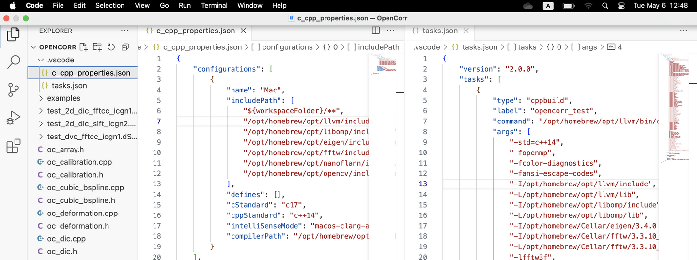

# 1. Get started

OpenCorr is developed and tested in Microsoft Visual Studio 2019 (VS, community version) on Windows 10. The environment is updated to VS 2022 and Windows 11 now. The codes, following the standard of ISO C++ 14, can be compiled using other C++ compiler like GCC, or on other OS like Linux/Unix. To work with this library, you need have basic knowledge and skill about integrated development environment (IDE) like VS. In the following two subsections, we demonstrate the configuration of IDE on Windows using Visual Studio and on macOs using Visual Studio Code (VS Code).

## 1.1 Configuration on Windows

The building environment requires four open source libraries:

- Eigen 3.4.0 ([eigen.tuxfamily.org](http://eigen.tuxfamily.org)), used for basic operations of 2D matrix.
- OpenCV 4.10.0 ([opencv.org](http://opencv.org)), used to read images, extract and match the 2D image features.
- FFTW 3.3.5 ([fftw.org](http://fftw.org)), used to speed up the calculation of cross correlation.
- nanoflann 1.7.0 (https://github.com/jlblancoc/nanoflann), used to search for the nearest neighbors of a point among a point cloud.

These libraries provide comprehensive instructions for installation. The main procedure can be summarized as the following steps:

1. Download the source files (e.g., .h or .cpp), static library files (.lib), and dynamic link library files (.dll) from the websites;

2. Place them into proper folders in your computer. For example, I created a project named OpenCorr in VS. The source codes are stored in folder "D:\OpenCorr\OpenCorr\", the files of the four libraries mentioned above are placed in folder "D:\OpenCorr\", as shown in Figure 1.1;

   

   *Figure 1.1. An example of folder structure*

3. Set the paths of source files and static library files in VS through Project --> Properties, as illustrated in Figure 1.2;
   
   *Figure 1.2. Illustration of setting directories of libraries in Visual Studio*

4. Set the additional dependencies in VS through Project --> Properties. Open the Additional Dependencies dialog, as shown in Figure 1.3;
   

   *Figure 1.3. Illustration of setting additional dependencies in Visual Studio*

Then, add the name list of static library files into the edit box. Beware that the file name ends with "d" in Debug mode for opencv lib.

>libfftw3-3.lib
>libfftw3f-3.lib
>libfftw3l-3.lib
>opencv_world4100.lib

5. Place the dynamic link library files (.dll) into the folder where the executable programs are built (e.g. "D:\OpenCorr\x64\Release\" in Figure 1.1), or the directories listed in system Path;

6. Set OpenMP support to enable the acceleration on multi-core CPU, as shown in Figure 1.4.
   
   *Figure 1.4. Illustration of setting OpenMP support in Visual Studio*

To facilitate the configuration for beginners, we made a compressed package of Visual Studio solution and share it on  [opencorr.org](https://opencorr.org/Download). Users may download and unzip it (e.g. using 7-Zip), then open OpenCorr.sln in VS 2022 or higher version of Visual Studio, and start programming.

There are a few examples in folder "examples" of GitHub repository along with images, which demonstrate how to make a DIC  or DVC program by assembling the modules in OpenCorr. Before building the executables, make sure that the file paths in the codes are correctly set. 

## 1.2 Configuration on macOs

It is recommended to install the four open source libraries (Eigen, OpenCV, FFTW, and nanoflann) through homebrew ([brew.sh](https://brew.sh)), which is a popular package manager for macOs. To compile the programs with OpenMP, LLVM needs to be installed (also can be done through homebrew). VS Code can be installed directly by downloading the package from its website ([code.visualstudio.com](https://code.visualstudio.com)). Afterward, C/C++ Extension Pack needs to be installed in VS Code.

Supposing that the codes of OpenCorr are placed in a folder like /Users/(your username)/Workshop/OpenCorr, open this folder in VS Code (Menu->File->Open Folder..). Then, choose  Tasks: Configure Default Build Task and Tasks: Configure Task in Command Palette (Menu->View->Command Palette). The two commands create two JSON files in sub-folder .vscode: c_cpp_properties.json and tasks.json. We can open the two JSON files in VS Code and add configuration of compiler, include path, and option of libraries (Figure 1.5).

*Figure 1.5. Configuration of building in Visual Studio Code*

There are examples of c_cpp_properties.json and tasks.json in folder "[examples/configuration](https://github.com/vincentjzy/OpenCorr/tree/main/examples/configuration)" of GitHub repository. You can download them and replace the ones in your folder. Just be careful about the path of the installed libraries could be different if the CPU of your computer is not an Apple Silicon type. The path can be checked using homebrew commands like "brew --prefix Eigen". Once configuration is completed, you can open an example (see Section 1.1) in VS Code and Run Build Taks (Menu->Terminal->Run Build Task) to build an executable. Check the path of images to process in the codes before building.

Developers who would like to use CMake to do the job may refer to a sample of CMake script (CMakeLists.txt) in folder "[examples/configuration](https://github.com/vincentjzy/OpenCorr/tree/main/examples/configuration)" of GitHub repository.
