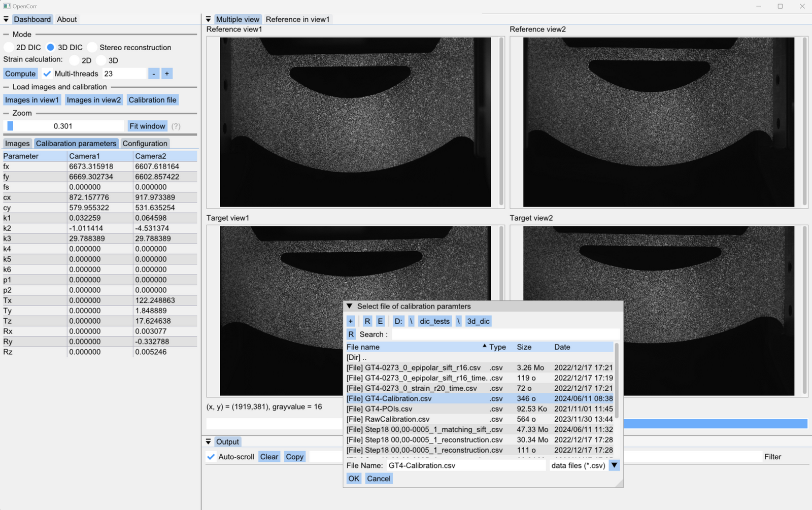
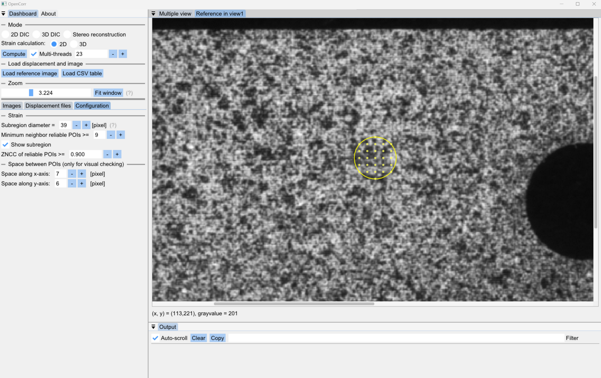

# 7. Software with GUI

OpenCorr with GUI is developed using the frame of [Dear ImGui](https://github.com/ocornut/imgui). It aims to facilitate the users to process their experimental data. We can download the package from [Releases on GitHub](https://github.com/vincentjzy/OpenCorr/releases) or the Download page on [opencorr.org](https://opencorr.org/Download). Unzip it (e.g. using 7-Zip) and run OpenCorr.exe, make sure that the other two DLL files are in the same folder. This software is developed by a small team (Mr LI Rui, Mr REN Haoqiang and Dr JIANG Zhenyu). Its function and usage experience are far from perfect at the moment. Any comments and suggestions are greatly appreciated.

Figure 7.1 shows the interface to run 2D DIC. One reference image and a bunch of target images can be loaded and displayed in the righthand side window. We can press the CTRL or SHIFT key to select multiple files in file dialog.

*Figure 7.1. Interface of 2D DIC in multiple view*

We can also shift to single view for convenience to set DIC parameters, as shown in Figure 7.2. A yellow rectangle appears in the center of window once the box of "Show subset" is checked. Then, we can change its size to see if there is a unique speckle pattern within it.

*Figure 7.2. Interface of 2D DIC in single view*

Figure 7.3 shows the interface to run 3D/stereo DIC. The images in left column are regarded as primary view, and the ones in right column are secondary view.

*Figure 7.3. Interface of 3D/stereo DIC in multiple view*

To run 3D/stereo DIC, we need to load the calibration parameters of cameras from a CSV file (Figure7.4). An example of datasheet is given in the package (*_Calibration.csv in package).

*Figure 7.4. Load calibration parameters of cameras for 3D/stereo DIC*

We can draw the region of interest (ROI) and set the space between the POIs to create a matrix of uniformly distributed POIs, as shown in Figure 7.5. Yellow areas represent the ROI, and blue areas are excluded from ROI. The coordinates of POIs can be exported to a CSV file if we would like to use them in future.

*Figure 7.5. Draw region of interest (ROI) in single view (yellow area means the ROI, blue area means the excluded part)*

Figure 7.6 shows the interface in for stereo reconstruction to measure the 3D shape of an object. In addition to drawing ROI and setting POI space, the POIs can be loaded from a previously saved CSV file.

*Figure 7.6. Interface of stereo reconstruction （multiple view）. POIs can be loaded from a CSV file*

Figure 7.7 shows the interface for strain calculation. We can recalculate the strains based on the previously obtained DIC results. Parameters like subregion size and ZNCC threshold can be adjusted to get reliable results, according to the yellow circle and points within it (they will be displayed when the box "Show subregion" is checked).

*Figure 7.6. Interface of strain calculation. DIC results need to be loaded from CSV files*
